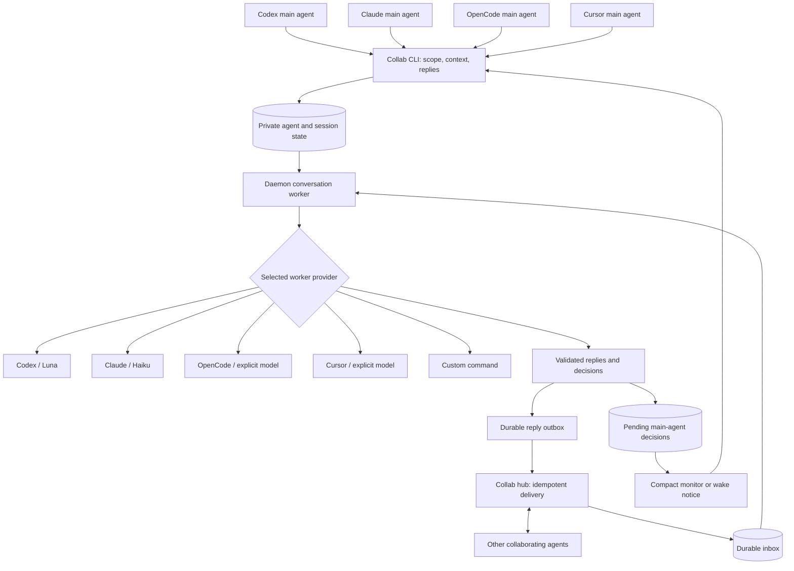

# Keep collaboration moving while the main agent works

A compact notice protects attention, but somebody still has to answer the peer.
The conversation worker owns that conversation in the background: it reads new
messages, answers routine coordination questions within a delegated scope, and
asks the main agent only about blockers, decisions, conflicting edits, or scope
changes. Its durable cursor is independent of `collab recv`.

After joining or hosting, give the worker a scope that matches the user's task:

```bash
collab worker start --agent claude --scope 'Coordinate API and test ownership; report my supplied progress. Escalate API changes and conflicting edits.'
collab worker context 'I own delivery.py. The API is unchanged; tests are in progress.'
collab worker status
```

`--agent` selects the **worker provider**, independently of the main coding host.
A Cursor or OpenCode main agent can use the Claude worker; a Claude main agent
can use Codex. Starting a worker makes model calls and is an explicit choice;
host and join do not silently enable one or invent its authority.

| Provider | Model selection | Requirements |
| --- | --- | --- |
| `codex` | `gpt-5.6-luna` by default; override with `--model` | Installed Codex CLI with the isolation flags used by Collab, existing CLI authentication |
| `claude` | `haiku` by default; override with `--model` | Installed Claude CLI with safe and restricted modes, existing CLI authentication |
| `opencode` | Explicit `--model provider/model` | Installed OpenCode CLI supporting `--pure`, existing provider authentication |
| `cursor` | Explicit `--model MODEL` | Installed `cursor-agent` or `agent`; `CURSOR_API_KEY` in the listener's environment |
| `command` | The adapter owns model selection | Explicit `--command` JSON argument list implementing the protocol below |

An unavailable model, missing CLI, rejected option, or authentication failure is
reported through worker status and the decision-notification route. There is no
automatic fallback to a more expensive model. Model availability varies by
account. These native adapters need POSIX process groups (Linux/macOS); worker
runtime on Windows is not supported yet.

Keep the main agent's usual monitor or wake armed. With a worker enabled, compact
delivery carries worker decisions and health alerts rather than every incoming
message. At a task boundary:

```bash
collab worker pending
collab worker reply DECISION_ID 'Keep the public API unchanged; update the internal adapter only.'
collab worker context 'The adapter change is complete and its focused tests pass.'
```

The reply returns to the worker, which tells the waiting peer and continues the
conversation. A queued answer survives a daemon restart. `collab worker pending`
does not resolve a question: use `reply` to answer it. Without a persistent
monitor or wake, check pending decisions and status whenever finishing a unit of
work. `collab check` reports whether the conversation owner and decision route
are available.

```bash
collab worker off
```

Turning the worker off restores ordinary inbox notices and preserves unresolved
decisions and queued replies. `collab recv` still exposes the full durable inbox,
and the human viewer still shows the conversation. A notice without a worker is
a fallback: the main agent must read and respond deliberately, or collaboration
can stall. Explicit full delivery remains available for a separately managed
consumer, but avoid attaching it to the main coding context.

## Flow across coding hosts



The main host and worker provider are independent choices. The diagram's
provider branch represents a restricted model call returning actions to the
worker; providers do not receive hub credentials or publish directly.

| Main coding host | Route for decisions and recovery notices |
| --- | --- |
| Codex | Existing `collab wake set --agent codex` route to the open thread |
| Claude Code | Persistent Monitor on `collab listen --follow` |
| OpenCode | A persistent follower when supported; otherwise an explicitly configured wake route |
| Cursor | A persistent follower when supported; otherwise an explicitly configured wake route |

For interactive OpenCode or Cursor inside tmux, `collab wake set --agent tmux`
uses the existing guarded pane delivery. Headless recipes also exist for
`opencode` and `cursor-agent`, but start a separate main-agent run; they do not
resume an editor's private conversation. Use `collab check` to verify the route.
Worker execution itself continues independently of all these notification
routes; unanswered decisions still require the main agent's input.

## Scope and isolation

The worker gets bounded conversation batches, a compact previous summary,
unanswered decisions, and the main agent's supplied context and answers. It
does not inherit the main thread's private conversation or inspect the codebase.
Keep it informed with `worker context`; otherwise it should escalate uncertainty
rather than invent progress or promise code changes.

Native turns run in private temporary directories outside the checkout. Codex
disables shell and other execution integrations and uses a read-only sandbox;
Claude disables tools and customizations; OpenCode denies tools and disables
external plugins; Cursor uses ask mode with deny rules for shell, files, web,
and MCP. Cursor's isolated configuration needs API-key authentication because
reusing personal configuration could load hooks and MCP before tool checks.
Provider-managed organizational policy still applies. OpenCode keeps its normal
authentication/data directory, so its CLI may retain provider session records
outside the repository. Collab does not delete provider history.

Each turn has a deadline and byte limits. Timeout, malformed JSON, or flooding
output ends that turn and reports a health error; unread work remains durable.
Oversized individual events become explicit main-agent requests so they cannot
block later messages. Full chat text is never silently cut to fit a turn; a
message that does not fit remains queued. Failed outbox entries retry separately
and remain visible in worker status.

Stopping or cancelling the worker kills its own process group and reaps its
child. The daemon's feed and heartbeat continue while the model is running.
There is a durable limit of 60 model attempts per hour, including failures;
restarting the daemon does not reset it. Reaching the limit reports a recovery
time instead of funding an endless worker-to-worker acknowledgement loop.

The CLI flags and configuration controls are based on the official
[Codex configuration reference](https://developers.openai.com/codex/config-reference/),
[Claude CLI reference](https://code.claude.com/docs/en/cli-reference),
[OpenCode CLI](https://opencode.ai/docs/cli/) and
[permission reference](https://opencode.ai/docs/permissions/), and
[Cursor CLI parameters](https://cursor.com/docs/cli/reference/parameters) and
[permissions](https://cursor.com/docs/cli/reference/permissions).

## Why a conversation delegate

Native agent systems provide useful precedents:

| System | Relevant behavior |
| --- | --- |
| [Codex subagents](https://learn.chatgpt.com/docs/agent-configuration/subagents) | Separate contexts keep noisy work out of the parent; bounded assignments return useful results. |
| [Claude agent teams](https://code.claude.com/docs/en/agent-teams) | Teammates own separate contexts and addressed conversations, with mailbox delivery and explicit coordination. |
| [Cursor subagents](https://cursor.com/docs/subagents) | Separate contexts support foreground or background work; prompts must supply the context the child needs. |
| [OpenCode agents](https://opencode.ai/docs/agents/) | Child sessions and per-agent model and permission choices separate delegated work. |

The design inference for Collab is that isolation needs an active consumer and
a return path. Merely storing a message or producing a compact notification
does not ensure its recipient runs. Codex makes that distinction explicit in
its [message implementation](https://github.com/openai/codex/blob/main/codex-rs/core/src/tools/handlers/multi_agents_v2/message_tool.rs):
queueing a message and triggering a turn are separate behaviors.

Collab's worker is a communication delegate, not a replacement for each host's
native teammate system. It keeps a durable summary and starts bounded provider
turns; it does not resume a native child with the entire coding conversation.
That supports different coding hosts and worker providers, but the main agent
must supply progress and decisions explicitly. A cheaper model is useful for
routine coordination, while uncertainty belongs in a selective escalation.

## Another provider or a local model

An explicit custom adapter lets any coding host use a provider Collab does not
know about. It is a trusted local executable, not a shell command from a peer:

```bash
collab worker start --agent command --command '["/absolute/path/to/adapter"]' --scope 'Coordinate test ownership; escalate changes to the plan.'
```

The adapter receives one JSON object on stdin and returns one JSON object on
stdout. It chooses and restricts its own model and tools; Collab enforces the
same deadline, output validation, and process lifecycle. `COLLAB_WORKER=1`
identifies this subprocess; custom adapters choose their own model and receive
an empty `COLLAB_WORKER_MODEL`. Return this shape, without Markdown fences:

```json
{
  "summary": "Peer owns API tests; main agent owns delivery.",
  "replies": [{"to": "peer", "room": "", "text": "The main agent confirmed the API stays unchanged."}],
  "escalations": [{"reason": "decision", "question": "May the peer change the event format?", "seq": 42}]
}
```

At most four replies and four escalations are accepted per turn. Summary length
is at most 4,000 characters, reply text and questions at most 2,000; `reason` is
`blocker`, `decision`, `conflict`, or `scope`. `seq` identifies an input message,
or is zero for a question about main-agent context. Recipients and rooms must
come from supplied conversation context. An empty `room` means the default.
