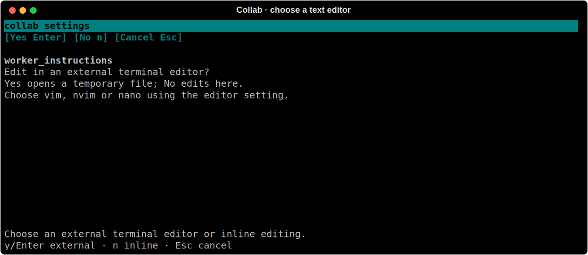

# Editing settings in the terminal


This is a real tmux terminal buffer rendered with a disposable configuration.

Run `collab config --tui` to browse and change the same settings available from
`collab config <key> <value>`. The editor needs an interactive terminal.

Use the arrow keys or `j` / `k` to select a setting, or click its row. The mouse
wheel moves through the list. `/` or **Search** filters names and descriptions;
press Enter to finish searching. `?` or **Help** shows the controls.

Enter or **Edit** opens a draft. For text, first answer «Edit in an external
terminal editor?» with **Yes** / Enter or **No** / `n`. Yes opens a private
temporary file with the current value; save and quit your editor to bring its
UTF-8 content back into the draft. Enter / **Save** then applies it; Escape
still discards it. No keeps you in the inline editor.



Set the `editor` setting to `vim`, `nvim`, `nano`, or an executable with arguments
(for example `nvim -f`). Empty uses `$VISUAL`, then `$EDITOR`, then `vi`.
Commands are split into arguments without a shell; GUI editors need their wait
option. A failed editor, invalid UTF-8, or a draft over 32,000 characters leaves
the setting unchanged. Temporary drafts are deleted when the editor returns.
A final editor-added line ending is removed for single-line settings such as
model names; multiline guidance, reminders and commands retain their content.

For inline editing, type the value, use Home / End and the arrow
keys to move the caret, and Ctrl-U to clear it. Ctrl-N inserts a newline for
rules and worker instructions. Space or **Toggle** changes a boolean draft.
Enter or **Save** validates and writes the value. Escape or **Cancel** discards
the draft. Invalid values stay in the editor with the registry's error message.
Commands are edited as text; saving a configured command lets its usual runtime
consumer use it.

`r` or **Reset to default** shows the default and asks for confirmation before applying it.
A star beside a setting means its effective value differs from its default.

Changes saved by another terminal appear automatically. Saving rereads the
selected value; if it changed while the draft was open, the editor keeps that
external value and asks you to cancel and reopen. Unrelated external changes
are preserved by the setting's normal writer. Most settings reload immediately;
name and colour updates to an active session run after closing the editor.

Filter for `worker` to adjust its default provider models, budget, timing and
instructions. Filter for `watch_participant` to choose the panel's field order
and initial expansion. Filter for `stats_prices` to enter exact model rates as
JSON, in USD per million tokens, for example:

```json
{"example-model": {"input": 1, "output": 2, "cached_input": 0.1}}
```

These example rates only illustrate the format. Estimates require the exact
model identifier and your supplied prices.

The same choice is available outside the TUI:

```bash
collab config editor nano
collab config worker_instructions --edit
collab config worker_instructions --unset
```

`--edit` requires a terminal. Text asks whether to open the external editor;
other settings ask for a new value inline. A successful CLI edit validates and
saves on return. `--unset` directly restores the default without an editor.

Participant decoration is controlled by `watch_background`,
`watch_background_image`, `watch_background_dim`, `watch_background_fps` and
`watch_reduced_motion`. These settings reload live. `none` disables effects;
`theme` follows the selected theme. Image paths are absolute local PNG/JPEG
files. See [themes](theme-engine.md) for image size and rendering limits.
