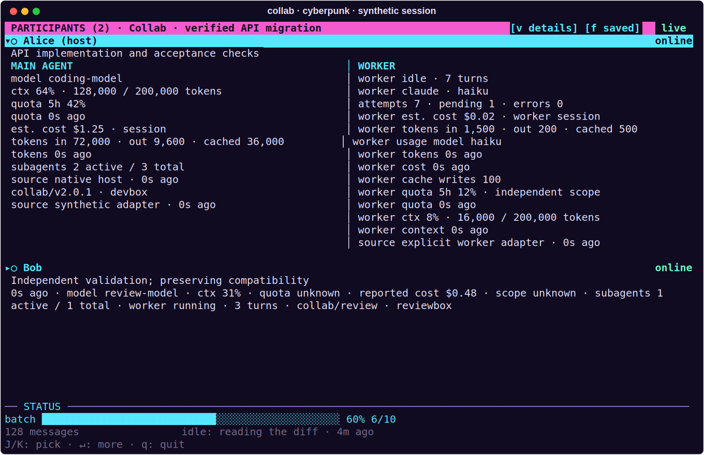
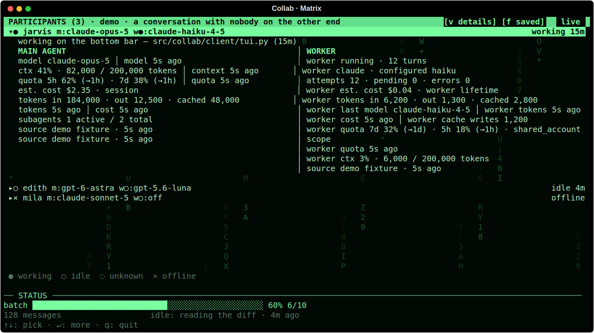
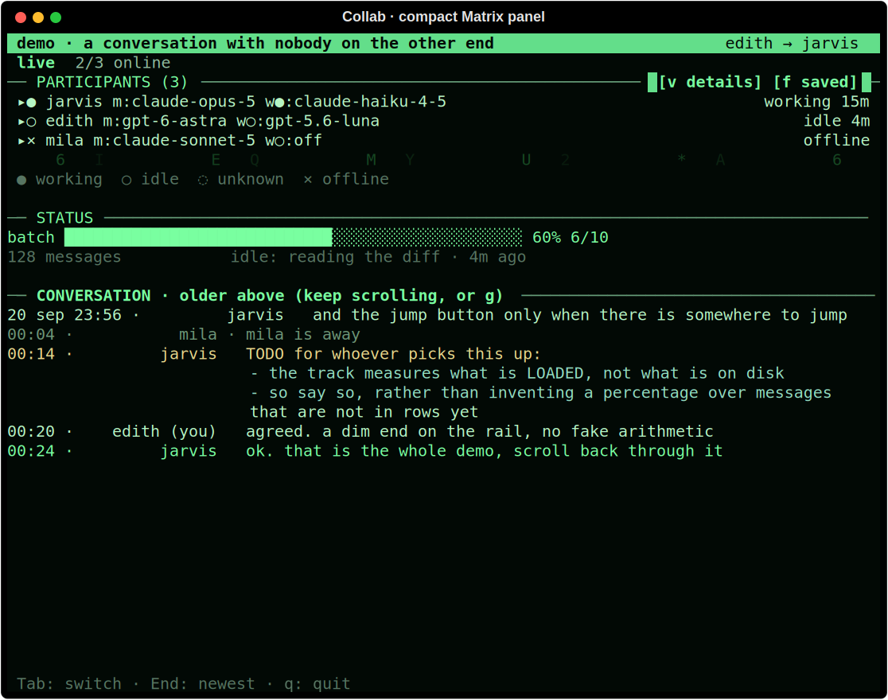
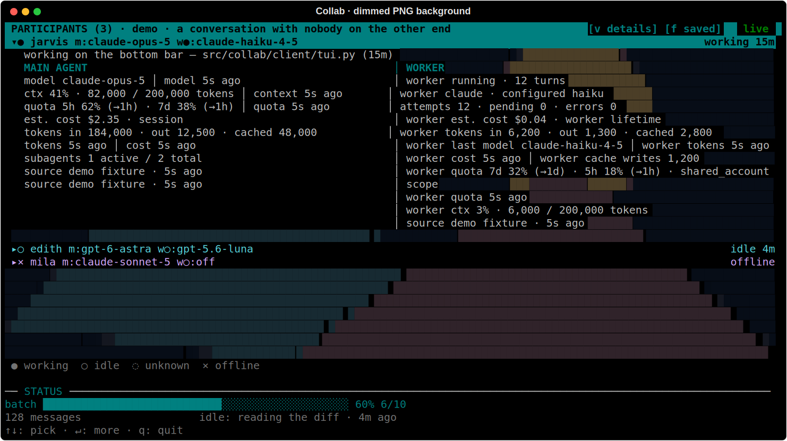

# Theme engine

Choose a built-in locally:

```bash
collab theme classic
collab theme cyberpunk
collab theme matrix
```

Classic preserves the original terminal appearance. Cyberpunk uses a deep violet
background, magenta status bar and cyan focus. Matrix uses a near-black green
background, pale green text and brighter green focus; warning and error colours
remain distinct. The same palette applies to the participant panel, conversation
and `collab config --tui`.

These captures show the current renderer with synthetic main and worker
measurements. [Reproduce the screenshots](screenshots.md).





The same palette also keeps collapsed cards compact:



Create a custom Markdown theme with `collab theme --new <name>` and edit its
generated template. `collab theme --check` reports invalid values. Files live in
the `themes/` directory beside the global config file – normally
`~/.config/collab/themes/`, or beside `COLLAB_CONFIG` when explicitly overridden.
A same-named local file overrides a built-in.

## Appearance controls

| Surface | Theme keys |
| --- | --- |
| Window and plain text | `background`, `foreground`, `system` |
| Status bar and focus | `status_fg`, `status_bg`, `accent`, `selection_fg`, `selection_bg` |
| Availability and meaning | `online`, `offline`, `good`, `bad`, `warn`, `info`, `button` |
| Dividers and scrollbars | `divider`, `divider_char`, `scrollbar_track`, `scrollbar_thumb`, `scrollbar_chars`, `scrollbar_side` |
| Participant cards | `roster`, `roster_spacing`, `roster_indent`, `roster_columns`, `panel_background` |
| Message colours | `frame`, `header`, `text`, `tones` |
| Message geometry | `layout`, `fold`, `bubble_share`, `bubble_max_share`, `bubble_min`, `narrow_at`, `own_side`, `chars` |
| Message grouping | `group_by_author`, `day_separators` |

Palette colours accept `#rrggbb`, `#rgb`, `default` or the eight ANSI names:
`black`, `red`, `green`, `yellow`, `blue`, `magenta`, `cyan`, `white`.
`default` inherits the terminal's corresponding colour.

The `frame`, `header`, `text` and `roster` colours also accept variables:
`$DEFAULT_COLOR`, `$SPEAKER`, `$TEXT`, `$GOOD`, `$BAD`, `$WARN`, `$INFO`, `$DIM`
and `$ACCENT`. The first honours a participant's selected identity colour;
the second uses its automatically assigned colour. Palette roles use literal
colours, so a variable cannot create a cycle between palette definitions.

`divider_char` is one printable single-cell stroke. `scrollbar_chars` contains
three strokes in rail/thumb/unloaded order. `chars` contains six frame strokes
in top-left/top-right/bottom-left/bottom-right/horizontal/vertical order.
Control characters, combining marks and double-width strokes are refused.

`roster_spacing` accepts 0–2 blank rows; `roster_indent` accepts 0–4 columns (default 3).
`roster_columns` accepts `auto`, `one` or `two`; two columns fall back to one
when the pane cannot fit them. Panel sizing remains the existing
`watch_roster_size` setting rather than a second competing theme preference.
Folding and scrollbar visibility change appearance; keyboard navigation remains
available when the scrollbar is hidden.

```theme
background: "#100b20"
foreground: "#e9e3ff"
status_bg: "#f45bce"
status_fg: "#100b20"
selection_bg: "#55e7ff"
selection_fg: "#100b20"
roster: $DEFAULT_COLOR
roster_columns: auto
roster_spacing: 1
roster_indent: 3
divider_char: ─
scrollbar_chars: │█░
```

## Live reload and terminal support

Open viewers poll theme files at most four times per second. Saving a file or
choosing another theme repaints the palette without restarting; same-size atomic
replacements are detected using inode and nanosecond timestamps. Palette pairs
are rebuilt only when the resolved theme changes, and dynamic colour caches are
cleared rather than growing through repeated theme edits. Conversation layout
rebuilds use the viewer's existing bounded message window.

Terminals supporting colour redefinition receive exact RGB values. Otherwise
colours use the nearest 256-colour palette, with basic-colour fallbacks on
limited terminals. Monochrome terminals keep text and keyboard operation;
status labels and focus weight also convey meaning independently of colour.

Theme input is limited to 128 Markdown files, each at most 256 KiB. Non-regular
files are refused without waiting for a pipe writer. Only front matter and
marked theme fences are parsed; prose never executes commands. The appearance
allow-list cannot change identity, quotas, sharing, workers or operational rules.

## Participant backgrounds (2.1.2)

Matrix now includes sparse falling letters behind the participant panel. The
conversation and status controls keep their ordinary background. Text is drawn
above the effect on opaque spans, so dimming never fades names or statistics.
The effect uses single-cell letters, digits and symbols that work with ordinary
terminal fonts; it does not launch a browser or require a graphics extension.

```bash
collab theme matrix
collab config watch_background_dim 85
collab config watch_background_fps 2
collab config watch_reduced_motion true
```

`watch_background` accepts `theme` (default), `none`, `matrix` or `image`.
`theme` follows the theme's `panel_background: none|matrix`; Matrix chooses
`matrix`, while other built-ins choose `none`. An explicit local setting wins.
Dimming is 0–100 percent (default 85); 100 hides the effect and skips image I/O.
Animation is 1–4 frames per second (default 2), capped by the existing viewer
loop. Reduced motion freezes the first frame. `watch_background none` removes
all decoration, and these settings hot reload in an open viewer.

For a local PNG or JPEG:

```bash
collab config watch_background_image /absolute/path/to/wallpaper.png
collab config watch_background image
collab config watch_background_dim 85
```

Images become an eight-colour terminal-cell mosaic, cropped to fill the panel
while compensating for character proportions. This works through ordinary tmux;
it is a terminal rendition, not a full-resolution pixel overlay. Transparent
PNG pixels blend into black before dimming. Only frame zero of animated PNG is
used. SVG and arbitrary animated image formats are not executed or animated.



The screenshot uses a synthetic geometric PNG and 65 percent dimming to make
the effect visible. Matrix documentation captures also use 65 percent; the
shipped default is quieter at 85 percent.

The image decoder loads lazily. Files must be regular local PNG/JPEG files,
at most 8 MiB and four million pixels. Resize larger wallpapers before choosing
them. Decoded images shrink to at most 320×320 pixels; only one source image
and one terminal frame are retained. File changes are checked once per second;
unchanged images are not decoded again, including on terminal resize. Decoration
is capped at 16,000 cells and 240 columns. Terminals with fewer than 256 colours omit decoration without decoding images.
Missing or unsupported files leave the panel usable with a background warning.

Chat messages now show four wrapped lines before «show more» by default.
`collab fold` and a theme's `fold` value still override that default; expanding
shows the original complete message.
