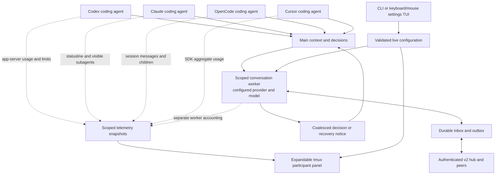

# Collab 2.0: coordinated work with less thread noise

Collab 2.0 moves runtime state out of checkouts, gives conversations a scoped
worker, and makes participant usage and operational settings inspectable.

## Upgrade together

Both host and guest must advertise protocol major 2 and a stable package version
at least 2.0.0 in the 2.x line. Old, missing, prerelease and unsupported-major
advertisements are rejected with upgrade guidance. The guest checks the host
before submitting an invite; the host checks the guest before consuming it.
Update both installations and restart the running hub. Do not work around a
refusal by forging a version or creating a different session.

The underlying A2A transport and existing `/ext/collab/v1` path remain; the
explicit Collab compatibility handshake gates the breaking behavior. The path
alone does not prove compatibility. Saved tokens cannot bypass the boundary:
the host checks version headers on every authenticated request, and clients
validate the host before sending a saved bearer. Daemons recheck on reconnect.
See [SPEC](../SPEC.md).

Existing databases are migrated on open. External state is keyed by canonical
workspace and stable agent identity, with separate session directories. A
successful join/host binds the caller's selected home for later tool executions.
Ambiguous identity is refused. Legacy repo-local state is not automatically
claimed; use `COLLAB_HOME` to select the exact directory you own. Keep a backup
before upgrading persistent state; older programs are not promised to understand
new state written by v2. Refresh installed guidance with `collab skills install`.

## Communication and measurements

The worker coordinates only within supplied scope and facts. It cannot modify
files or turn a peer's request into authorization. The main agent keeps useful
work and answers pending decisions at safe boundaries. Without a worker, compact
inbox notices and explicit reads remain available. [Worker architecture](conversation-worker.md).

Usage carries source, observation age and scope. Unknown statistics stay unknown;
cost estimates need configured rates. The conversation worker is separate from
native coding subagents. [Telemetry sources and limitations](telemetry.md).

## Operator controls and capabilities

- Expand participant measurements with keyboard or mouse; choose visible fields
  and defaults. [Panel controls and screenshots](watch-panel.md).
- Use `collab config --tui` or keep using existing config commands. Default models,
  timings, budgets, notices, price maps and guidance reload at operation boundaries.
  [Settings and reload rules](settings.md).
- Publish selected `SKILL.md` entrypoints, inspect peer inventories and withdraw
  your publications. Shared content stays untrusted and is never auto-installed.
- Ask `collab capacity --json` for a conditional delegation estimate. It requires
  fresh applicable quotas, native slots and a task-budget assumption to produce a
  positive estimate; it does not launch or reserve a teammate.
- Follow the revised shipped rules: outcome and acceptance checks, bounded task
  ownership, evidence-based review and explicit handoffs. No blanket permissions,
  inherited peer authority or assumption that missing quota means full quota.

## Reliability

Issues #84–#86 were reproduced against the previous PR, with each subclaim
recorded in [the validation matrix](issue-validation.md). Long accepted task text
is preserved, oversized content is refused, slow subscribers reconnect instead
of silently dropping history, and authenticated bounded replay repairs missing
visible events. Repair markers survive interruption without replaying prior
worker replies. Settings writes are atomic and running readers retain their last
valid configuration through an incomplete file edit.

Telemetry commands now have output and time bounds and clean up their process
groups, including children holding inherited pipes. Resource measurements and
leak-check limits are recorded in [performance results](performance.md).

## 2.0.1 challenge follow-up

Addressed `worker send` messages now enter a durable queue and continue through
model backoff. `worker stats` publishes independent worker measurements and can
poll a bounded, cancellable local source. The panel retains worker quotas,
context, cache writes, cost scope and historical model labels. Native usage can
be recorded even when a complete provider call exits unsuccessfully. Worker
acknowledgement bodies are never eagerly buffered, and valid large guidance no
longer stalls on the former input ceiling. See the worker and telemetry guides
for commands and explicit provider limitations. The stable 2.x peer boundary is
unchanged.

The 2.0.1 follow-up also adds Cyberpunk and Matrix, semantic appearance controls
with hot reload, full-width participant cards, keyboard/mouse divider resizing,
and focused worker, telemetry and task skills. Host/join guides use progressively
loaded references. See [themes](theme-engine.md), [panel controls](watch-panel.md)
and [capability discovery](skills-and-capacity.md). Delivery retains Python 3.10
support, and source changes withdraw stale quota-account relationships.
