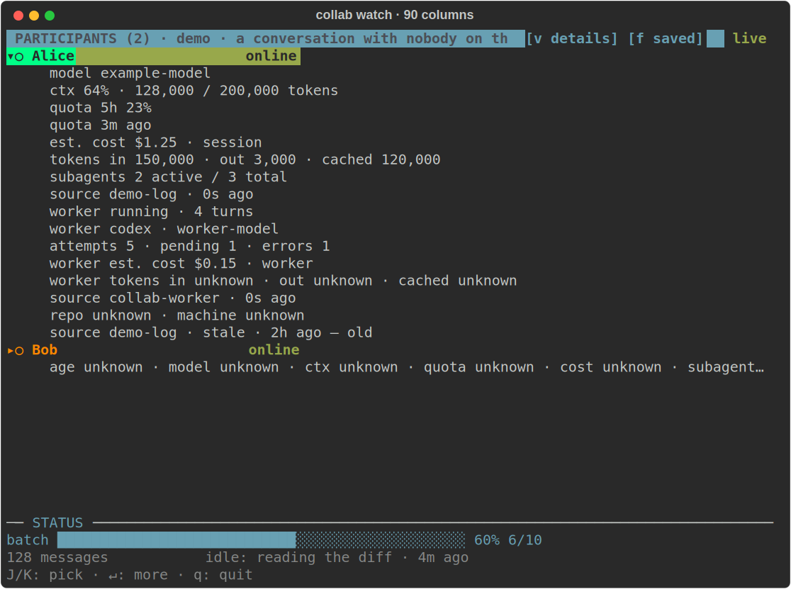
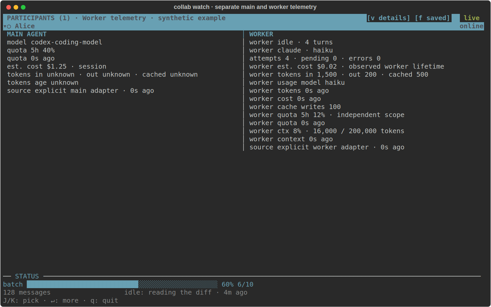

# Reading the live participant panel

The image above renders a real tmux terminal buffer with synthetic participants.
The [38-column capture](../assets/participant-panel-narrow.png) shows the same
measurements wrapped for a narrow side panel.

Each collapsed participant occupies exactly one padded, participant-coloured line:
identity, `m:` main model, `w` worker state/model, and working/idle duration.
Both model columns remain present when expanded field filters change. Long names
are shortened to fit; expansion shows full model names and every selected stat.
Up/Down (or J/K) selects participants. Right opens, Left closes, and Enter/Space
or clicking a header toggles details. Page Up/Down, j/k and the mouse wheel scroll
long details. Tab changes panes. End/G in the conversation resumes live following.

The fixed legend reads «● working ○ idle ◌ unknown × offline»; the worker uses
its own dot, with «off» when disabled. Unknown activity is never called idle.
Participant colours are dealt randomly without reuse while colours remain, and
stay stable while present. Automatic colours adapt for contrast on known theme
backgrounds; a terminal default background without COLORFGBG cannot be measured.

Expanded cards separate main and worker measurements, side by side at 88 content
columns and stacked below that. A solo participant retains its local statistics
without waiting for another participant or a hub echo. Reaching the roster's
bottom never starts following new updates; layout changes preserve the reading
position. The conversation keeps its position within a message when rewrapped.

In the combined view, `+` grows the roster and `-` shrinks it by five percentage
points. Drag the `CONVERSATION` divider to preview the split; releasing saves
`watch_roster_size`, the same setting edited by the CLI and settings TUI. Only
the completed gesture writes configuration. In a tmux split, use tmux's native
pane resize controls. Layouts are cached independently of scroll offsets, and
mouse motion is requested only during a drag.

`v` toggles all participant details; `f` cycles the saved fields, usage fields,
and identity fields. The matching `[v details]` and `[f saved]` controls on
the participant heading also respond to clicks; narrow panes use `[v]` / `[f]`.
The controls stay visible while scrolling. These choices affect only this viewer.

Save defaults with `collab config watch_participant_details true` and
`collab config watch_participant_fields context,quota,cost,subagents,worker`.
The ordered fields are `model`, `context`, `quota`, `cost`, `subagents`, `worker`
and `location`. A saved change reaches an open pane immediately and replaces
its temporary field and disclosure choices. Expanded rows wrap to the pane
width; scroll to reach the remaining rows in a narrow tmux panel.

Unknown measurements say «unknown». Zero appears only when reported as zero.
Quota percentages are usage, not remaining allowance. Cost rows distinguish
estimated and reported amounts and name their scope; an absent kind or scope
is identified as unknown. A provider observation's timestamp determines its
age – a fresh heartbeat cannot make an old observation current. Quota readings
have their own age, so a newer token report cannot make an old allowance
reading current. Expanded
rows show the source; unavailable source or observation time stays unknown.

Coding subagents show active and total counts when known. The communication
worker has its own state, model, turns, attempts, pending items, errors, tokens
and cost. Its usage is displayed separately from the participant's session
usage because the two sources may overlap. A disabled worker does not imply
that coding subagents are absent.

### Separate worker allowance and context

The worker's quota, relationship to the main account, context, cache writes and
measurement ages are independent rows. «Unknown» is distinct from zero. The
configured next model and historical usage model are labeled separately. These
synthetic figures demonstrate layout; they are not a real account measurement.

In a narrow transcript, a dated header now moves above the body when it would
leave fewer than twelve text columns. Crossing midnight no longer causes
ordinary messages to fold just because the date appeared.

See the [theme engine](theme-engine.md) for semantic colors, safe glyphs and
participant spacing, indentation and column preferences. Cyberpunk and Matrix
are built-in options; appearance reloads without restarting the viewer.

### Opening terminal splits

`collab watch --panel` selects tmux when present, otherwise native macOS Ghostty
or iTerm2. Explicit choices are `--panel tmux`, `--panel ghostty`, and
`--panel iterm2`. Ghostty requires 1.3+ and enabled AppleScript automation.
Native macOS splits use the terminal's own proportions; `--percent` applies to
tmux. `--vertical` places the viewer below. macOS may request Automation access.
These native launchers have host-parsing tests which skip when the app is absent.

Windows Terminal supports WSL panes. From Windows Terminal, split with its menu
or `wt -w 0 split-pane -H wsl.exe`, then run the viewer inside the same WSL distro
with the participating agent's printed COLLAB_HOME. From WSL, Microsoft's documented
launch route is `cmd.exe /c wt.exe`; Windows Terminal does not yet have a Collab
native auto-launch backend. Ghostty on Linux can use tmux or a manually opened split.

References: [Ghostty automation](https://ghostty.org/docs/features/applescript),
[iTerm2 scripting](https://iterm2.com/documentation-scripting.html),
[Windows Terminal arguments](https://learn.microsoft.com/en-us/windows/terminal/command-line-arguments).

Worker details distinguish the configured model from the last model reported by
the provider. Claude stream responses supply actual model, context and both
quota windows when present. Codex exec supplies worker token totals but no
context-window measurement; an explicit worker quota source can report its
account allowance independently. Missing measurements are never zero.

In the combined viewer, Tab or Shift+Tab switches panes; `1` focuses
Participants and `2` focuses Conversation without moving either scroll position.
The footer shows keys for the focused pane. Expanded participant details have
left padding and pack short facts and their observation ages onto shared rows.
